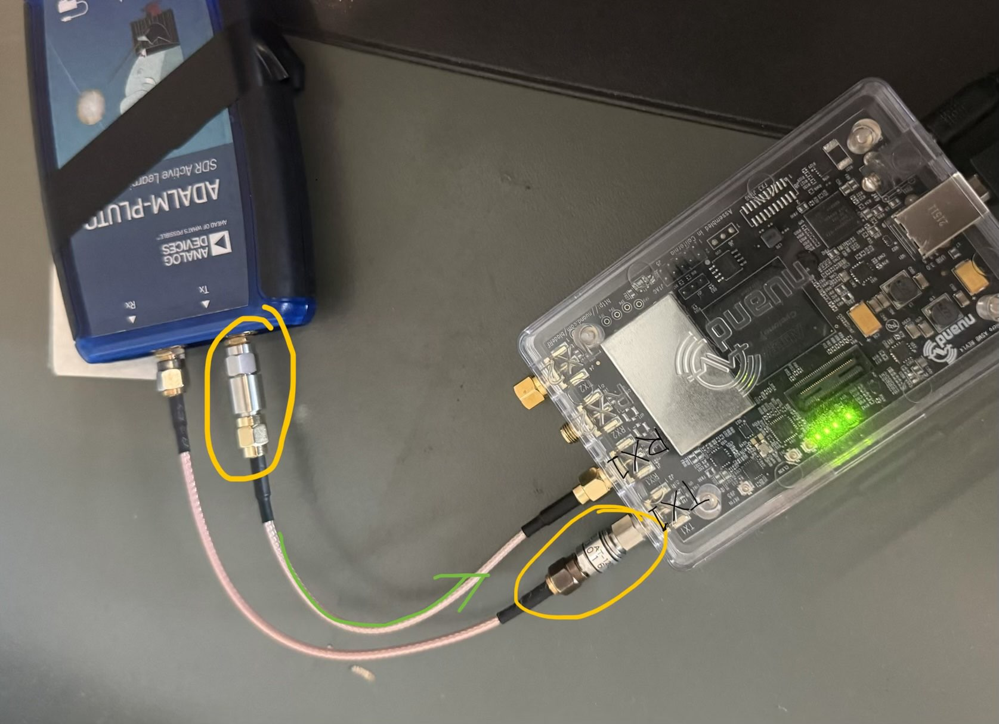

# V3.1 Documentation

This document will go over how the SDRs are setup for wired testing a brief explanation of the GNURadio flowgraph, what to expect if the flowgraph is working, and some next steps for improving this test.
# SDR Setup

Here is how the SDRs are setup for the wired testing. 

Signal is transmitted from the Tx port of the ADALM-PLUTO SDR (blue box, on the left) to the RX1 port of the BladeRF (clear box, on the right) through a wire. This matches the Tx-side `Soapy PLUTO Sink` and Rx-side `Soapy BladeRF Source` we have in our flowgraph.

Circled in yellow are **attenuators**. They are silvery little cylinders that reduce the power received, so that the Rx ports of SDRs are fried. _**Always remember to add attenuators, even in wireless testing!!_**

Note that the Pluto SDR Tx port is not working as of July 2026, thus this SDR configuration. (I forgot to add an attenuator when testing with antenna. Sorry y'all...)

# Flowgraph Structure
## Tx

### Source
Sends the signal specified by the variable `msg`. The input `msg` should match the `msg` specified in the Async BER calculator, if BER is zero.

### Pack K Bits

The constellation modulator takes in packed bytes, so we need to pack 8 bits into a byte. 

### Constellation Modulator
Takes a stream of packed bytes (8 bits), and outputs a complex signal with the specified constellation, the samples/symbol (`sps`), the excess bandwidth (`alpha`), and optionally, differential encoding. 

The constellation modulator does a lot of things at once. To reiterate: 
* It takes in packed bytes (**NOT BITS!!**). Since the `msg` we pass in is in 01001111... (bits), we needed the Pack K Bits block before this. 
* Mapping: The block maps 2 bits to a complex symbol, according to the symbol map (or, constellation) we specified. Here we use QPSK, so **TODO: check:** 00 to \[-1-1j\], 01 to \[-1+1j\], etc. See[ the second half of Tom's Lecture 2](https://www.youtube.com/watch?v=s10_glWnaQ8&t=771s)  for more information on symbol mapping. 
* Differential encoding: If enabled, the block uses the **change** between 00 and 01 (instead of 00 itself) to map to complex symbols instead. Differential encoding prevents issues like inverted polarity. 
* Root Raised Cosine Filter: for pulse shaping. Compared to square pulses, these shaped pulses take less bandwidth. (See the Tx Root Raised Cosine Filter for more explanations.)

Note: We do not use the GNU Radio default QPSK constellation, since it is not compatible with differential encoding. Make sure the constellation you make is gray coded. GNU Radio recommends using the Constellation Rect Object for QPSK. See this section: [Transmitting a QPSK Signal](https://wiki.gnuradio.org/index.php?title=QPSK_Mod_and_Demod#Transmitting_a_QPSK_Signal).

[GNU Radio official doc](https://wiki.gnuradio.org/index.php?title=Constellation_Modulator)
[GNU Radio's official docs for QPSK Mod](https://wiki.gnuradio.org/index.php?title=QPSK_Mod_and_Demod)
[Prof Jason](https://www.youtube.com/watch?v=91veeuSU_IQ&list=PLywxmTaHNUNyKmgF70q8q3QHYIw_LFbrX&index=19)

### Soapy Pluto Sink

Pluto SDR takes in the complex signal, upconverts it (adds the carrier with the specified frequency), and transmits it.
## Rx

### Soapy BladeRF Source
BladeRF takes in the signal, downconverts it, and gives the data to the computer. 

### Channel Model
Adds noise. Parameters we can change:
* `noise_voltage`: Adds AWGN (additive white gaussian noise). Visually, causes dots scatter in constellation sink.
* `frequency_offset`: adds phase noise. Can be positive or negative. Visually, causes constellation to spin faster. Should be corrected by FLL Band-Edge filter (coarse tuning) and Costas Loop (fine tuning). 
* `Epsilon`: timing offset. Should not have a big effect.

[official docs](https://wiki.gnuradio.org/index.php/Channel_Model)

### (Optional) AGC3
Automatic gain control. Should normalize the QPSK constellation to be the right "size". 

Apparently, AGC blocks in GNURadio are generally bad. AGC3 is the better out of the three, but it's still weird sometimes... It's probably easier to tune the receiver gain instead. 

### FLL Band-Edge Filter

Does frequency correction, corrects frequency offset. Visually, FLL should help move the frequency band to be centered at zero. 

The theory: [prof jason FLL. Go to 4:00](https://www.youtube.com/watch?v=jJHnJtcKW0M&list=PLywxmTaHNUNyKmgF70q8q3QHYIw_LFbrX&index=20).

FLL is a bit funky at times, and causes the constellation to spin (the opposite of what it's supposed to do -- FLL should correct frequency offset, therefore reducing phase noise, causing the constellation to spin **less**). But FLL is probably needed for larger frequency offset. 

The `prototype filter size` is set to around 11\*sps, so that the filter works over 11\*sps samples. Make sure the `filter rolloff factor` parameter matches the `excess bandwidth` of the Tx constellation modulator. 

### Raised Root Cosine Filter

The second part of the Root Cosine pulse shaping filter. The constellation modulator on the Rx side does a Rasied Root Cosine filter, here we apply the second half. Together, they form a Root Cosine filter, which is optimal.

Make sure the `alpha` parameter matches the `excess bandwidth` of the Tx constellation modulator. 

Visually, it would change the frequency bandwidth. Recall that bandwidth is (1+alpha)\*(symbol_rate). See Tom's lecture: [DSP101 Lec3 Pulse Shaping](https://www.youtube.com/watch?v=PaNuB0BM1EM). 

`alpha` is usually 0.35 in GNU radio. **TODO: Did I leave it at 0.5???** We can probably tune it a bit more...

### Symbol Sync

Performs timing synchronization so that the signal is sampled at the right time. In other words, this block picks 1 sample per symbol, therefore reducing the amount of data by a factor of `sps`.

### Costas Loop

Fine phase correction. Visually, should cause constellation to stop spinning. 

`Loop bandwidth` is set to 2\*pi/100 as a rule of thumb. 

### Constellation Decoder
The opposite of a constellation encoder -- the decoder takes complex signals (e.g. 1+1j) and converts it back into bits (e.g. 11). 

Make sure the constellation here matches the constellation used in the Rx Constellation Modulator. 

### Differential Decoder

Undoes differential encoding done by Constellation Modulator, if the differential encoding option was selected. 

### Map

Maps 0, 1, 2, 3 to 0, 1, 3, 2. Needed because constellation decoder does some nearest neighbour thing, so somehow we get the natural ordering (0, 1, 2, 3) instead of the grey code we set in our constellation? Idk... **TODO: check**

### Unpack K bits

Unpacks 0, 1, 3, 2 into 2 bits. 0 ->0 0, and 1->0 1, etc.

### Skip Head

(Optional) I skip the 1st second of data, because the initial bits often contain junk. 

### Asynchronous BER Calculator

Built by Swarnava! Compares the bit stream passed into this block to the `msg`. The first output is the BER (bit error rate), while the second output can be ignore. 

# Expected Output

Here I explain the expected output, if the flowgraph works. 

### No spikes in time domain on Rx side

See [Spikes in time domain for BladeRF Rx](## Spikes in time domain for BladeRF Rx). If we add a waterfall plot right after the Rx side SDR, the waterfall plot should be smooth in the vertical direction, not choppy. 

### Expected Constellation

We can check the constellation after we do all of our complex domain processing by putting a constellation sink after the Costas Loop block. The constellation should ideally be four dots at ($\pm 1/\sqrt{2}$, $\pm 1/\sqrt{2}$). If not, the constellation is not locking correctly. One potential pathological constellation: [8 dots instead of 4](## 8-point constellation when frequency offset changes quickly). 

### BER

The number sink after the BER_calculator should show that the BER is close to zero. If the BER is 0.25 or 0.125, something funky and weird is happening in your code. If the BER is 0.5, the flowgraph is completely not working. 

### Example Output Plots

Here is a video of my running the flowgraph. Output here should be okay. Let's hope it stays okay. 

[video of flowgraph running](flowgraph_output.mp4)

# Remaining Problems
## Spikes in time domain for BladeRF Rx

The bladeRF has weird spikes in time domain when sample rates are high (around 1.5 MHz). The bladeRF has connected to the first port from the top, which is a USB 3.0 port. The issue has been happening for a while: [link to notion](https://app.notion.com/p/utat-ss/SDR-Testing-2a33e028b0ea80c5b22cd92985b8c0d5), see section "On BladeRF Transmit issue".

In the video, I show the weird behaviour by transmitting a sine wave. 

The sine wave should show up as a straight line. When samp_rate is low, it does show up as a line like this:
![[sine_wave_good_samp_rate_not_choppy.png]]

And not like this (this is when I made the samp_rate 6 MHz):
![[choppy_sine_wave_bad_samp_rate.png]]

The spikes may be due to a USB buffer size issue. One fix would be to do some processing in BladeRF FPGA...

## 8-point constellation when frequency offset changes quickly

When I change the frequency offset too quickly in the Channel Mode block, or when the initial frequency offset is too big, I sometimes get a 8-point constellation like this:

![[eight_point_constellation_bad.png]]

The kind people of reddit has offered me [some advice](https://www.reddit.com/r/GNURadio/comments/1uu4ds4/comment/oxt2vh4/?context=1&screen_view_count=2) on fixing this. By placing FLL before RRC, and raising the sample rate, I was able to get the 8-point constellation to appear less. (Hopefully it stays that way. Cross your fingers!)

I am not going to account for big frequency offsets, since the main frequency offset comes from Doppler shift, which we will account for in future code. The current flowgraph only accounts for slower frequency offsets. We can probably spend more time fine-tuning the FLL Band-Edge Filter's `Num Taps` and `Loop Bandwidth???` if we want to account for bigger offsets. 

### BladeRF is "cold"

For some reason, BladeRF sometimes needs to run a bit before it works the way we want it to. As they say, restarting your computer (restarting the flowgraph, in our case) fixes 90% of problems...?
